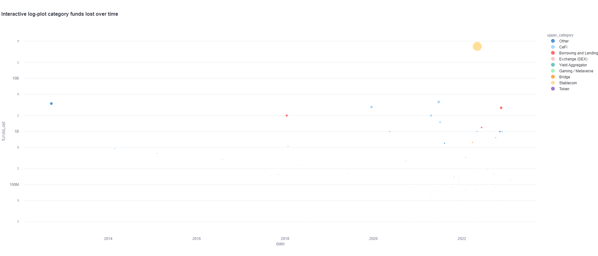

# rekt-analysis
Analysis of Rekt Database from DeFi Yield App. This is a task to present key insights from the Rekt database.
For fetching the data I used [GraphQL](https://graphql.org/). For processing the data I used mostly [pandas](https://pandas.pydata.org/).
I also used an [NLP technique](https://pypi.org/project/polyfuzz/) to combine similar categories. 
Most of the visualizations are done with [Plotly express](https://plotly.com/python/plotly-express/). 
For creating a single-page application, I used [Streamlit](https://streamlit.io/).
Finally, I did the deployment via [Heroku](https://www.heroku.com).

The Streamlit deployed app can be found under this [link](https://intense-brook-89215.herokuapp.com/). 

**Important Note** The Streamlit application takes approx. 1min to load and render

**Another important note** There are several tabs for different analysis in the Streamlit app, please make sure to take
a look at the different tabs ("Issue Type", "Upper-category", "Sub-category" and "Seasonality")

This repository contains the analysis of the major web3 rekts. The code is implemented under the src/ directory.
Under the src/ directory, a Streamlit dashboard is implemented at src/app to visualize key insights. 
The data is fetched and processed at src/main.py. A seasonality analysis is done at src/seasonality.py. 
Inside the img/ directory, some plots are saved to visualize insights.
The repository has the following structure
```
project
│   README.md
│   requirements.txt
│   Procfile
│   setup.sh
│
└───img
│   │ figure_1.png  
│   │  ...
│   │ figure_n.png
└───src
    │   app.py
    │   main.py
    │   queries.py
    │   seasonality.py
```

## DeFiYield App Sources
- [DeFiYield API docs](https://docs.defiyield.app/api/api)
- [Rekt Database docs](https://docs.defiyield.app/audits/rekt-database)
- [Rekt Database app](https://defiyield.app/rekt-database)

Available fields from Rekt database are: id, projectName,description, data, fundsLost, fundsReturned, chainIds, category, issueType, token

## Findings
### Note on number of rekts analyzed
I ran a rekt analysis with the 1000 rekts where the largest funds where lost. Some rekts are missing for this analysis.
However, I decided to focus just on the largest 1000 rekts to avoid exploiting the Rekt API. The user can fetch more rekts
by passing a larger limit to the get_all_rekts() method implemented under the main.py file.

### Key insights
These are the insights that I gathered when fetching the 1000 largest rekts on the 7th of February 2023.
- The average lost of funds per rekt is approx. $74.7M. The average returned funds after occurred is approx. 5.95M
- So far 74.4B dollars have been lost by rekts, and 5.9B dollars have been returned
- Rekts have an increasing trend since 2011 with a peak on 2022 with a strong seasonality effect during the months of 
January/February and November/December where the number of rekts is more volatile
- The most frequent rekt issue are rugpulls, other issue types, and asset control. However, the most vulnerable issue 
type are undefined issues "other". A representative example under these undefined issue types is the collapse of the 
Terra Luna ecosystem where more than 40B dollars where wiped out. Abandoned issue types do not see funds returned durin
rekts. On the contrary, reentrancy have the largest returned funds with close to 66%
- The most frequent upper-categories are CeFi, tokens and DEX. However, the most vulnerable upper-category is stablecoins
- The most frequent rekt sub-categories are tokens, centralized finance (CeFi) and decentralized exchanges (DEX). However, 
the most vulnerable sub-categories are stablecoins and borrowing/lending in CeFi. Borrowing and lending stablecoins from 
decentralized exchanges do not see funds returned during rekts. On the other hand, there are a high number of undefined
categories "other" that see 85% of the funds returned after a rekt

### Result images
Several images displaying findings and results are saved under the img/ folder. Underneath are a few examples of the plot.
For all the visualizations, please look at the [Streamlit app](https://intense-brook-89215.herokuapp.com).

#### Funds lost per issue type


#### Funds lost per upper-category rekts



#### Seasonality effect


## Instructions to run the script and replicate the results
- This code uses an API from DeFiYield App to fetch the rekt database. To maintain its privacy, the API key is stored 
under an .env file. Please add an .env file before executing the code and set your API value to the variable "X-Api-Key"
- The working directory is the parent directory
- The queries are made on the link https://public-api.defiyield.app/
- To test other queries, use the DeFiYield [playground](https://public-api.defiyield.app/graphql/)
- To run the main.py script, install the dependencies in the requirements.txt file, then run src/main.py
- To run the Streamlit app, write in the command line "streamlit run src/app.py"

## Future work
The following points are ideas on how to expand the current rekt analysis and continue the implementation
- Improve the performance of the Streamlit app. Another alternative is creating a Dash application where the render is
more performant
- Implement more NLP tasks to gather further insights from the rekt descriptions. Some ideas that I have in mind are the following:
  - [Zero-shot classification](https://huggingface.co/facebook/bart-large-mnli) to present an alternative clustering of different rekts categories based on their description 
  - [Similarity analysis](https://huggingface.co/sentence-transformers/all-MiniLM-L6-v2) to visualize similar rekt descriptions
  - [Question answering](https://huggingface.co/distilbert-base-cased-distilled-squad) to explain the reason behind complex rekts 
  - [Summarization](https://huggingface.co/philschmid/bart-large-cnn-samsum) task to give in a nutshell the main exploit reasons
  - [Topic modelling](https://maartengr.github.io/BERTopic/index.html) to represent the key topics of the rekt descriptions
- Expand dashboard enabling further granular analysis on chain and token
- Analyze how a project token evolve after a scam. Analyze how costly is every scam for the ecosystem